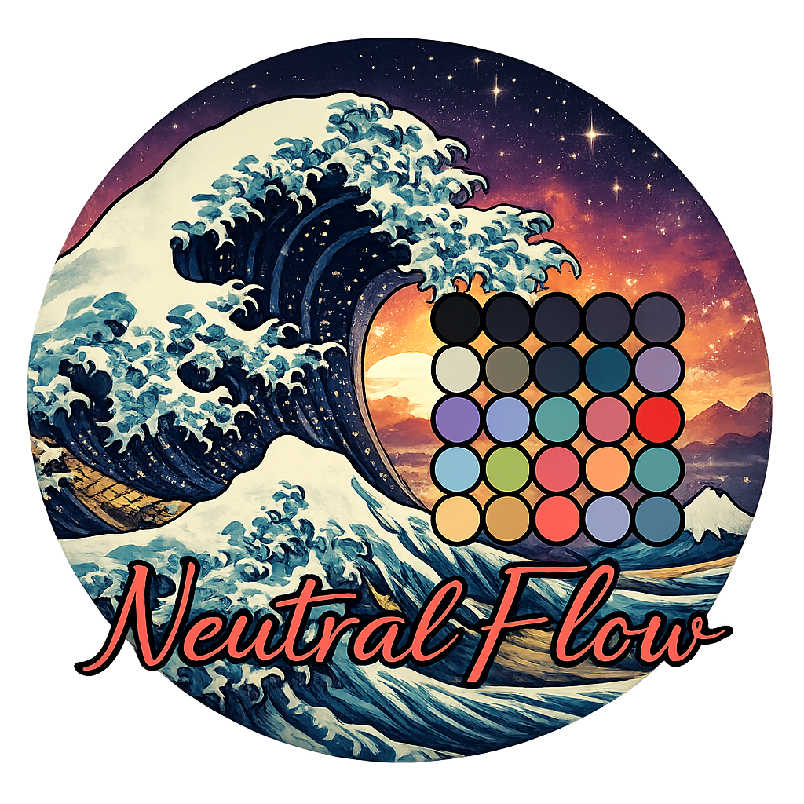
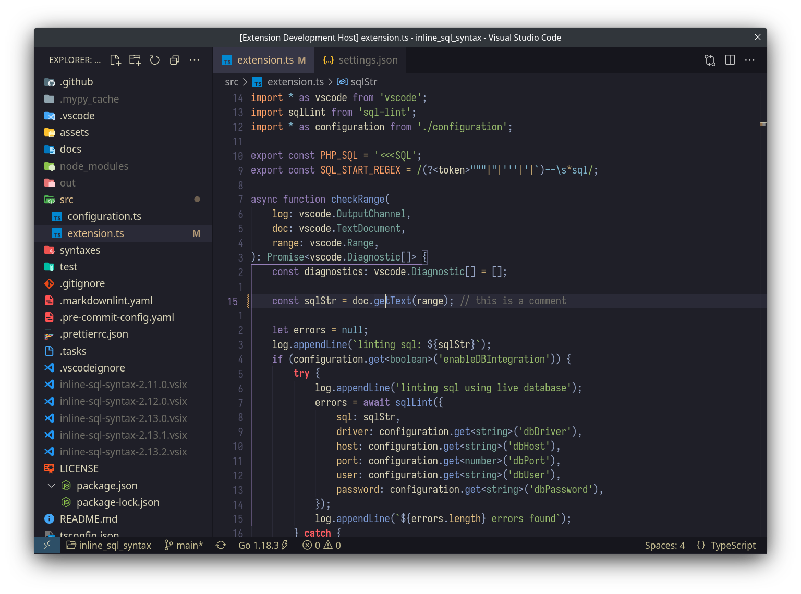

<p align="center">
  <h2 align="center">NeutralFlow</h2>
  <p align="center">
    A clean, calm dark theme with neutral tones designed for focused and comfortable coding.
  </p>
</p>

<p align="center">
  
</p>

<br>

<p align="center">
  
</p>

## Available Themes

NeutralFlow comes with **7 beautiful color variations**, each with a unique accent palette while maintaining the same calm, neutral base:

| Theme | Accent Color | Description |
|-------|--------------|-------------|
| **NeutralFlow** | Purple (#957FB8) | Original theme with purple accents - balanced and professional |
| **NeutralFlow Emerald** | Green (#4A7C59) | Nature-inspired green tones - fresh and calming |
| **NeutralFlow Sapphire** | Blue (#5B7C99) | Ocean-inspired blue tones - cool and focused |
| **NeutralFlow Amber** | Orange (#D48C3E) | Warm sunset amber tones - energetic and warm |
| **NeutralFlow Rose** | Pink (#C85A6C) | Soft rose pink tones - gentle and creative |
| **NeutralFlow Violet** | Violet (#8B6FA3) | Deep violet purple tones - creative and sophisticated |
| **NeutralFlow One Dark Pro** | Multi-color | Inspired by One Dark Pro - vibrant and popular |

### How to Switch Themes

1. Press `Ctrl+K Ctrl+T` (or `Cmd+K Cmd+T` on macOS)
2. Select your preferred NeutralFlow variant from the theme picker
3. Enjoy your new color scheme!

## Semantic tokens

Theme supports and recommends enabling semantic tokens.

### TypeScript

Enabled by default.

### Go

```json
{
  "gopls.ui.semanticTokens": true
}
```

#### rust-analyzer

```json
{
  "rust-analyzer.highlighting.strings": true
}
```

#### `C#`

```json
{
  "csharp.semanticHighlighting.enabled": true
}
```

## Customization

### Comments

If you prefer comments to stand out in your code - this looks nice:

```json
{
  "editor.tokenColorCustomizations": {
    "[NeutralFlow]": {
      "comments": {
        "foreground": "#FF9E3B"
      }
    }
  }
}
```

Paste it in your `settings.json`.
